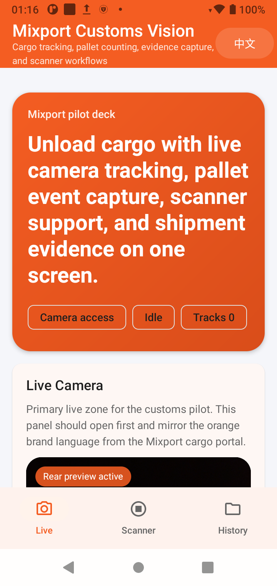
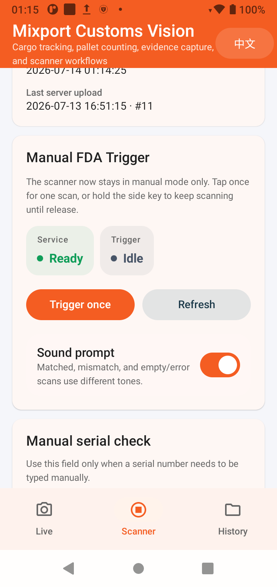
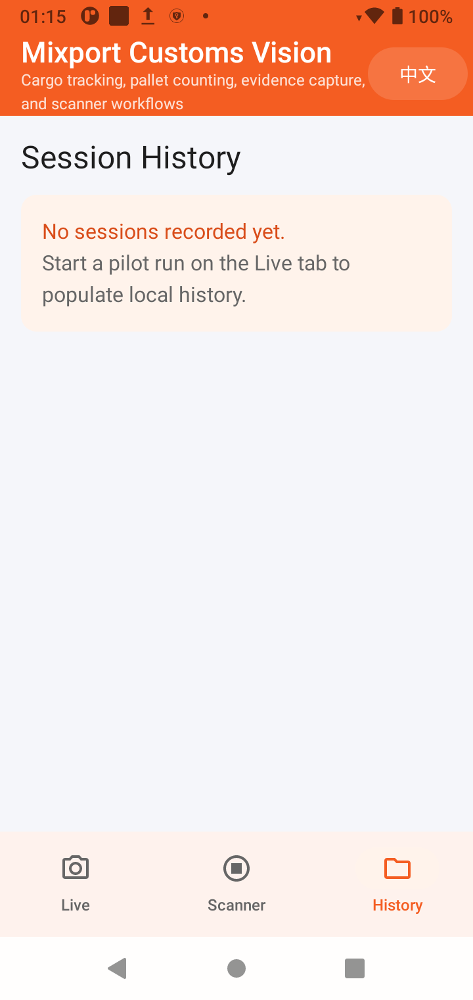

# Mixport Customs Vision Android

Android pilot app for Mixport's container unloading workflow. The app combines:

- live cargo tracking and pallet counting
- front FDA scanner integration for Hikrobot PDA hardware
- bilingual English / Chinese UI
- local evidence capture and offline-first session storage
- server-backed scanner cache sync with manual batch upload
- stale-scan reconciliation so historical mismatches can downgrade into audit-only logs

This repo is for the first pilot company, using the same company server stack later for API sync. The Android client does not connect directly to the production database.

## Current release

- GitHub repo: [kndhjk/mixport-customs-vision-android](https://github.com/kndhjk/mixport-customs-vision-android)
- Latest release page: [Releases](https://github.com/kndhjk/mixport-customs-vision-android/releases/latest)
- Release artifacts: `app-arm64-v8a-release.apk`, `app-armeabi-v7a-release.apk`

## What the app does

### 1. Live customs / unloading workflow

- opens on the `Live` page by default to avoid PDA service startup lag
- shows the rear-camera preview before a session starts
- upgrades from preview-only mode to tracking / counting mode after a session starts
- records unloading sessions and pallet events
- tracks cargo movement into a pallet workflow
- keeps local history for sessions, pallets, item summaries, and event logs
- stores video evidence clips to `Movies/MixportCustoms`

Live page snapshot on Hikrobot PDA:

<p align="left">
  
</p>

### 2. FDA scanner workflow for Hikrobot PDA devices

- targets the embedded front FDA scanner head
- does not expose the rear camera or FDA video preview on the scanner page
- keeps the scanner page in manual trigger mode only
- supports PDA side hardware scan keys:
  - tap once: one scan
  - hold the key: repeated scan until release
- shows the scanned serial number and database comparison result at the top of the page
- keeps the result card green only when both `NZCS` and `MPI` are `clear`
- turns the result card red immediately when either `NZCS` or `MPI` is `failed`
- turns the result card yellow for every remaining matched `hold` combination, including `clear + hold` and `hold + hold`
- uses different tones for matched, mismatch, and empty/error results
- runs barcode cleanup and clearance-status normalization through a small JNI C hot path, with Kotlin fallback preserved for unsupported inputs

Scanner page snapshot on Hikrobot PDA:

<p align="left">
  
</p>

### 3. Mobile recognition baseline

- live full-frame object proposals stay lightweight for phone performance
- richer OCR, color, and label logic runs only on stable cropped targets
- current baseline uses ML Kit plus heuristic pallet / cargo logic
- future model path is a quantized, crop-based transformer-friendly classifier

### 4. Local history / session review

- the `History` page keeps an on-device session trail for offline field work
- before the first unloading run, the page shows a clear empty state instead of a blank workflow

History page snapshot on Hikrobot PDA:

<p align="left">
  
</p>

## Pilot architecture

The current company stack is PHP + MySQL on Mixport infrastructure. The Android app is structured as:

- local capture first
- future PHP API sync second
- shared company database behind the API, not inside the mobile app
- the private backend implementation lives in the companion Mixport website repo under `private-sync/`

That keeps the pilot safer and makes multi-company rollout possible later through config, branding, and API separation.

## Hardware notes

### Hikrobot PDA scanner devices

- the scanner page is built for the PDA's front FDA hardware, not a generic rear phone camera flow
- the app expects the PDA service package to exist on the device
- front light and FDA trigger flow are controlled through the vendor broadcast/service bridge already wired in this repo
- the scanner page can now pull HBL cache data from `GET /private-sync/scanner-sync/bootstrap`
- pending offline scan results can be uploaded manually to `POST /private-sync/scanner-sync/upload`
- when a sync profile is provisioned, each scan verifies against `POST /private-sync/barcode/verify` first and only falls back to the local cache if the live server is unavailable
- if a barcode originally failed because the shared database had no row yet, later successful verification automatically reconciles the old failure into an audit-only log instead of leaving it as dirty sync data
- release builds keep the server sync profile provisioned in-build instead of exposing worker-facing token entry fields

### Standard Android phones

- the `Live` page uses the rear camera and rear flash through CameraX
- the rear preview can stay live before a session starts, while heavy analysis waits until the operator opens a session
- the PDA scanner page is only fully functional on supported Hikrobot hardware

## Build and run

### Prerequisites

- Android Studio with SDK 34
- Java 17
- Android NDK `26.1.10909125`
- CMake `3.22.1`
- a real Android device for camera / PDA validation
- for Hikrobot scanner validation: the vendor PDA service must already be installed on the device

### Local debug build

```powershell
.\gradlew.bat :app:assembleDebug
```

### Local release APK

```powershell
.\gradlew.bat :app:assembleRelease
```

Release builds now emit ABI-specific APKs under `app/build/outputs/apk/release/` so field devices install a smaller package.

Current release builds are debug-signed on purpose so the pilot APK stays easy to install before a dedicated production signing flow is introduced.

### Install to a connected device

```powershell
C:\Users\zyzmc\AppData\Local\Android\Sdk\platform-tools\adb.exe install -r .\app\build\outputs\apk\debug\app-debug.apk
```

For release APK testing:

```powershell
C:\Users\zyzmc\AppData\Local\Android\Sdk\platform-tools\adb.exe install -r .\app\build\outputs\apk\release\app-arm64-v8a-release.apk
```

## Validation commands

```powershell
.\gradlew.bat :app:testDebugUnitTest
.\gradlew.bat :app:assembleDebug
.\gradlew.bat :app:assembleRelease
```

## Scanner sync workflow

1. Open the `Scanner` page.
2. On provisioned release builds, the Mixport sync profile is already embedded; only device-specific setup remains.
3. Tap `Pull latest cache` to download the active parent / child HBL scanner dataset into local SQLite.
4. With the network available, each scan uses the live Mixport lookup first so internal ops edits show up immediately; if the server is unreachable, the app falls back to the last synced local cache.
5. After the scan is written into the local queue, the app now attempts an immediate server upload whenever the device still has network access and a valid sync profile.
6. The scanner page also runs a lightweight foreground retry loop, so when the Hikrobot device comes back online the pending queue is retried automatically without waiting for the next scan.
7. If the network is unavailable or the upload call fails, the scan stays in the local pending queue and can still be retried manually via `Upload pending`.
8. When a barcode later becomes valid, the app automatically reclassifies older local `MISMATCH` / `ERROR` rows for that same code into audit-only history before upload.

Manual upload remains available for offline backlog recovery, but the normal online workflow is now immediate auto-upload per scan with periodic foreground retry while the scanner page stays open.

## Commercial sync safeguards

- `lookupBarcode()` is live-first when the release sync profile is provisioned, so internal ops edits no longer stay hidden behind stale local cache hits.
- local scanner history keeps the original failed scan for traceability, but the SQLite upload queue now adds reconciliation metadata and can mark superseded failures as `AUDIT_ONLY`.
- cache refresh also performs a second-pass reconciliation. If the latest scanner bootstrap now contains a previously missing barcode, the older local failure is downgraded before batch upload.
- the server upload endpoint re-verifies every uploaded barcode against the current shared database. If the row now resolves, the API stores it as `AUDIT_ONLY` with an effective matched outcome instead of polluting business mismatch/error counts.
- internal ops scanner audit views can now distinguish effective matched rows from audit-only reconciled rows.

## Problems fixed in this release

- `Admin/support updated, but the PDA still mismatched`: fixed by preferring live `POST /barcode/verify` before local cache and deleting stale cached references when the server says `found=false`.
- `Alias/barcode edits were not reaching devices during incremental sync`: fixed by advancing the bootstrap cursor from the latest `cargo_tracking`, child-HBL alias, and barcode-alias timestamps.
- `Old failed scans stayed in the business queue after a later successful scan`: fixed with local and server-side reconciliation so the old row becomes audit history instead of dirty operational data.
- `Manual upload could still over-count outdated failures`: fixed by computing an effective server-side match state and excluding audit-only reconciled rows from operational scan counters.

## Training-data intake

When real pallet images, wrapped-pallet photos, and container cargo photos are ready, initialize the intake scaffold first:

```powershell
C:\Users\zyzmc\AppData\Local\Programs\Python\Python313\python.exe .\tools\dataset_intake.py --dataset-root .\training-data --init
```

After dropping images and annotations into `training-data/raw/...`, run:

```powershell
C:\Users\zyzmc\AppData\Local\Programs\Python\Python313\python.exe .\tools\dataset_intake.py --dataset-root .\training-data
```

That generates:

- `training-data/manifests/inspection_dataset_manifest.json`
- `training-data/manifests/inspection_tuning_profile.generated.json`
- `training-data/reports/inspection_dataset_summary.md`

Reference docs:

- [docs/dataset-intake.md](docs/dataset-intake.md)
- [docs/mobile-transformer-plan.md](docs/mobile-transformer-plan.md)

## Current boundaries

- pallet and cargo recognition are optimized for on-device runtime, but the final custom-trained model is not in the repo yet
- the PDA scanner workflow depends on the vendor runtime and device firmware
- no production secrets are stored in the repo
- release builds remain pilot-oriented and debug-signed even though GitHub releases are published for field testing

## Project map

- `app/`: Android source
- `docs/api-contract.md`: planned pilot sync contract
- `docs/sql/pilot_schema.sql`: proposed server-side schema
- `docs/dataset-intake.md`: dataset folder contract
- `docs/mobile-transformer-plan.md`: mobile model/runtime rollout plan

## Next steps toward commercial rollout

1. Train a real pallet / cargo model from the incoming dataset.
2. Add wrap-completion confirmation from consecutive frames.
3. Tighten container-empty detection with scene-level evidence.
4. Surface uploaded scanner batch summaries directly inside the internal ops cargo dashboards.
5. Promote release signing from debug signing to a production keystore flow.

