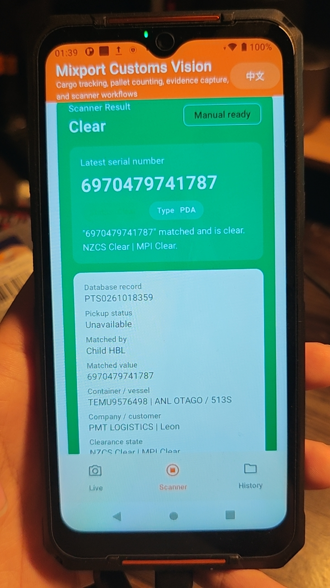
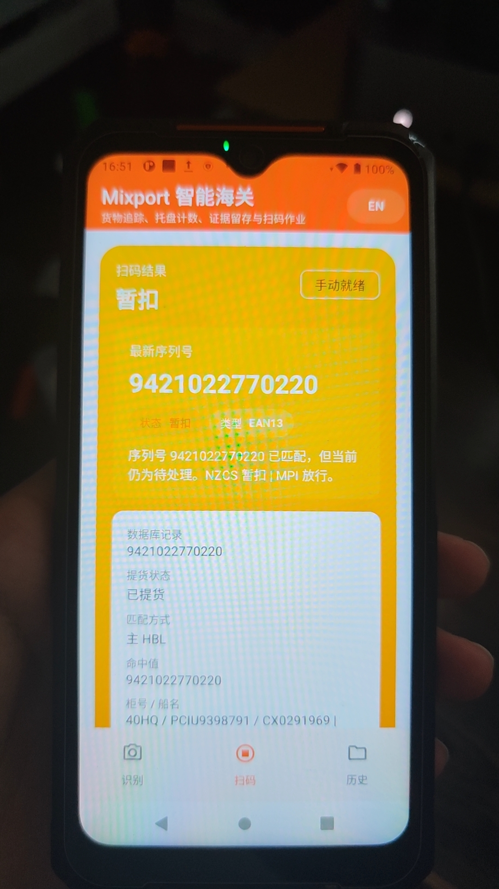
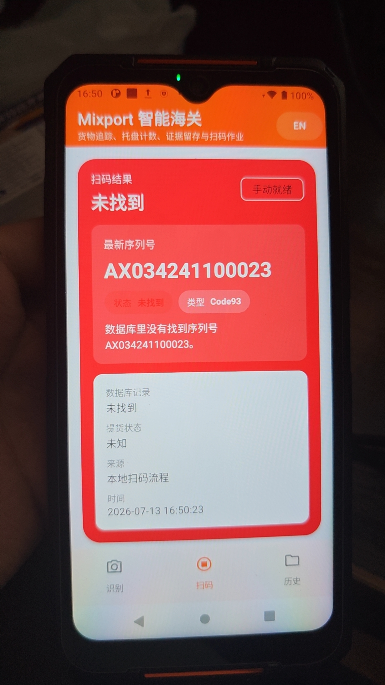
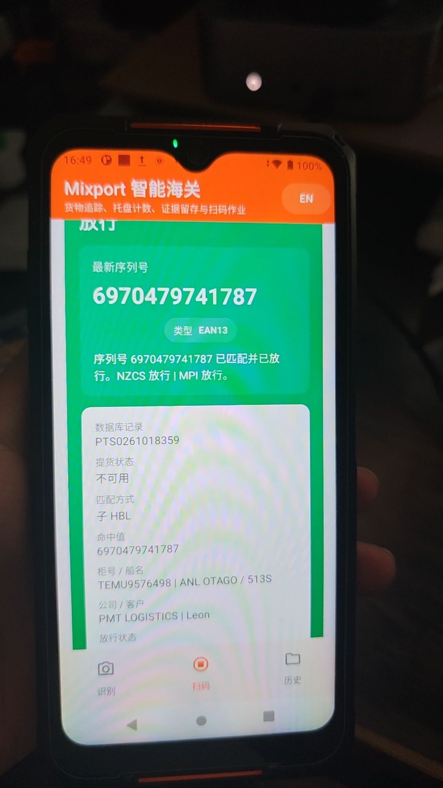
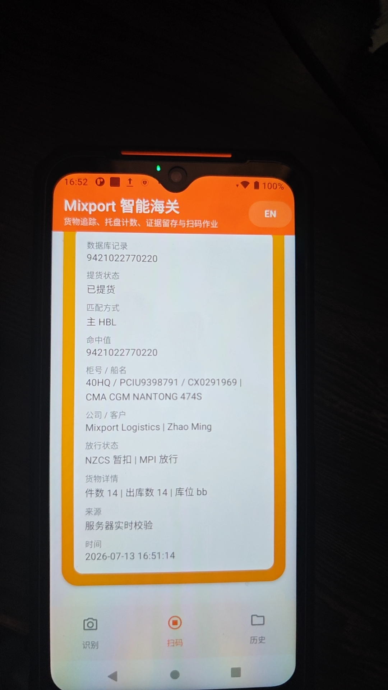

# Mixport Customs Vision Android

Android pilot app for Mixport's container unloading workflow. The app combines:

- live cargo tracking and pallet counting
- front FDA scanner integration for Hikrobot PDA hardware
- bilingual English / Chinese UI
- local evidence capture and offline-first session storage
- server-backed scanner cache sync with manual batch upload
- stale-scan reconciliation so historical mismatches can downgrade into audit-only logs

This repo is for the first pilot company, using the same company server stack later for API sync. The Android client does not connect directly to the production database.

## Current release

- GitHub repo: [kndhjk/mixport-customs-vision-android](https://github.com/kndhjk/mixport-customs-vision-android)
- Latest release page: [Releases](https://github.com/kndhjk/mixport-customs-vision-android/releases/latest)
- Release artifacts: universal `app-public-debug.apk` plus a hardened `arm64-v8a` `app-public-release.apk`

## What the app does

### 1. Live customs / unloading workflow

- opens on the `Live` page by default to avoid PDA service startup lag
- shows the rear-camera preview before a session starts
- upgrades from preview-only mode to tracking / counting mode after a session starts
- records unloading sessions and pallet events
- tracks cargo movement into a pallet workflow
- keeps local history for sessions, pallets, item summaries, and event logs
- stores video evidence clips to `Movies/MixportCustoms`

Live page snapshot on Hikrobot PDA:

<p align="left">
  
</p>

### 2. FDA scanner workflow for Hikrobot PDA devices

- targets the embedded front FDA scanner head
- does not expose the rear camera or FDA video preview on the scanner page
- keeps the scanner page in manual trigger mode only
- supports PDA side hardware scan keys:
  - tap once: one scan
  - hold the key: repeated scan until release
- shows the scanned serial number and database comparison result at the top of the page
- keeps the result card green only when both `NZCS` and `MPI` are `clear`
- turns the result card red immediately when either `NZCS` or `MPI` is `failed`
- turns the result card yellow for every remaining matched `hold` combination, including `clear + hold` and `hold + hold`
- uses different tones for matched, mismatch, and empty/error results
- keeps barcode cleanup and clearance-state normalization on a tiny C/JNI bridge with Kotlin fallback, while the heavier package-size win comes from `arm64-v8a`-only release packaging

Scanner page snapshot on Hikrobot PDA:

<p align="left">
  
</p>

Latest field photos from the Hikrobot PDA test run:

<p align="left">
  
  
  
</p>

<p align="left">
  
  
</p>

### 3. Mobile recognition baseline

- live full-frame object proposals stay lightweight for phone performance
- richer OCR, color, and label logic runs only on stable cropped targets
- current baseline uses ML Kit plus heuristic pallet / cargo logic
- future model path is a quantized, crop-based transformer-friendly classifier

### 4. Local history / session review

- the `History` page keeps an on-device session trail for offline field work
- before the first unloading run, the page shows a clear empty state instead of a blank workflow

History page snapshot on Hikrobot PDA:

<p align="left">
  
</p>

## Pilot architecture

The current company stack is PHP + MySQL on Mixport infrastructure. The Android app is structured as:

- local capture first
- future PHP API sync second
- shared company database behind the API, not inside the mobile app
- private backend wiring stays outside this public repository

That keeps the pilot safer and makes multi-company rollout possible later through config, branding, and API separation.

## Public repo safety

- no private deployment URL or bearer token is committed to this repository
- no bearer token is compiled into the APK or exposed through `BuildConfig`
- private sync provisioning now runs through a dedicated non-exported admin activity instead of the public launcher activity
- provisioning requests are validated for HTTPS, approved host suffixes, and device ID format before anything is written locally
- the worker-facing app UI does not expose sync credentials
- internal server wiring and dashboard-side auth details are intentionally omitted from the public docs

## Hardware notes

### Hikrobot PDA scanner devices

- the scanner page is built for the PDA's front FDA hardware, not a generic rear phone camera flow
- the app expects the PDA service package to exist on the device
- front light and FDA trigger flow are controlled through the vendor broadcast/service bridge already wired in this repo
- the scanner page can refresh a private reference cache when a secure sync profile is provisioned
- pending offline scan results can upload back to a private sync service
- when a secure sync profile is provisioned, each scan verifies live first and only falls back to local cache if the server is unavailable
- reprovisioning supersedes any still-pending uploads into audit-only local history before the new endpoint becomes active
- if a barcode originally failed because the shared database had no row yet, later successful verification automatically reconciles the old failure into an audit-only log instead of leaving it as dirty sync data
- secure sync provisioning is stored locally with Android Keystore-backed encryption and never shown in the operator UI

### Standard Android phones

- the `Live` page uses the rear camera and rear flash through CameraX
- the rear preview can stay live before a session starts, while heavy analysis waits until the operator opens a session
- the PDA scanner page is only fully functional on supported Hikrobot hardware

## Build and run

Two distribution variants now exist:

- `public`: hardened GitHub / portfolio release, with no exported external sync-provisioning alias
- `field`: company-device build, with the same package name and data store, plus the controlled external provisioning alias needed for on-site rollout and updates

### Prerequisites

- Android Studio with SDK 34
- Java 17
- a real Android device for camera / PDA validation
- for Hikrobot scanner validation: the vendor PDA service must already be installed on the device

### Local debug build

```powershell
.\gradlew.bat :app:assemblePublicDebug
.\gradlew.bat :app:assembleFieldDebug
```

### Local release APK

```powershell
.\gradlew.bat :app:assemblePublicRelease
.\gradlew.bat :app:assembleFieldRelease
```

Release builds now target `arm64-v8a` only so the published secure APK does not carry unused x86/x86_64/armeabi-v7a ML Kit native payloads. When no release keystore is configured, Gradle emits unsigned release APKs for controlled signing. GitHub release automation only publishes the hardened `public` artifacts, while the `field` artifacts stay local / internal.

To enable production signing locally or in GitHub Actions, provide these values through environment variables, Gradle properties, or an untracked `release-signing.local.properties` file:

- `ANDROID_RELEASE_STORE_FILE`
- `ANDROID_RELEASE_STORE_PASSWORD`
- `ANDROID_RELEASE_KEY_ALIAS`
- `ANDROID_RELEASE_KEY_PASSWORD`

### Install to a connected device

```powershell
C:\Users\zyzmc\AppData\Local\Android\Sdk\platform-tools\adb.exe install -r .\app\build\outputs\apk\field\debug\app-field-debug.apk
```

For public GitHub-release verification, install the universal public debug build locally unless a signed public release keystore is configured:

```powershell
C:\Users\zyzmc\AppData\Local\Android\Sdk\platform-tools\adb.exe install -r .\app\build\outputs\apk\public\debug\app-public-debug.apk
```

## Validation commands

```powershell
.\gradlew.bat :app:lintPublicDebug
.\gradlew.bat :app:testPublicDebugUnitTest
.\gradlew.bat :app:assemblePublicDebug
.\gradlew.bat :app:assemblePublicRelease
.\gradlew.bat :app:assembleFieldDebug
.\gradlew.bat :app:assembleFieldRelease
```

GitHub Actions now runs the same public lint, unit-test, and public/field build path for pull requests to `main`, not just after merge. Only the hardened `public` APKs are attached to GitHub releases.

## Scanner sync workflow

1. Open the `Scanner` page.
2. Provision a device-specific secure sync profile once, outside the worker UI.
3. Tap `Pull latest cache` to download the active parent / child HBL scanner dataset into local SQLite.
4. With the network available, each scan uses live server lookup first; if the server is unreachable, the app falls back to the last synced local cache.
5. After the scan is written into the local queue, the app attempts immediate upload whenever the device still has network access and a valid sync profile.
6. The scanner page also runs a lightweight foreground retry loop, so when the Hikrobot device comes back online the pending queue is retried automatically without waiting for the next scan.
7. If the network is unavailable or the upload call fails, the scan stays in the local pending queue and can still be retried manually via `Upload pending`.
8. When a barcode later becomes valid, the app automatically reclassifies older local `MISMATCH` / `ERROR` rows for that same code into audit-only history before upload.

Manual upload remains available for offline backlog recovery, but the normal online workflow is now immediate auto-upload per scan with periodic foreground retry while the scanner page stays open.

### Secure provisioning import

For company-device rollout, use the `field` build and a one-time admin launch intent to open the provisioning alias plus inject the private sync endpoint and bearer token into the device keystore-backed store:

```powershell
adb shell am start `
  -a nz.co.mixport.customsvision.action.APPLY_SYNC_PROVISIONING `
  -n nz.co.mixport.customsvision/.admin.ExternalSyncProvisioningAlias `
  --es nz.co.mixport.customsvision.extra.SYNC_API_BASE_URL "https://example.invalid/api/" `
  --es nz.co.mixport.customsvision.extra.SYNC_BEARER_TOKEN "replace-me" `
  --es nz.co.mixport.customsvision.extra.SYNC_DEVICE_ID "hik-001"
```

The provisioning flow is now split by distribution:

- `MainActivity` ignores sync provisioning extras entirely
- the shared admin provisioning activity remains `android:exported="false"`
- the `public` build has no exported external provisioning alias at all
- the `field` build keeps a dedicated alias for company-device rollout, so internal upgrades can preserve the existing data path without reopening the public release attack surface
- the request is rejected unless the URL is HTTPS and the host matches the approved allowlist
- the token is never rendered on-screen; the operator only confirms the validated host and target device ID
- applying a new profile clears cached server reference rows and supersedes still-pending uploads into local audit history before the new endpoint goes live

The app stores the imported profile locally in encrypted form, refreshes its startup cache, and keeps those values out of the visible worker flow.

## Commercial sync safeguards

- `lookupBarcode()` is live-first when a release sync profile is provisioned, so current server-side changes no longer stay hidden behind stale local cache hits.
- local scanner history keeps the original failed scan for traceability, but the SQLite upload queue now adds reconciliation metadata and can mark superseded failures as `AUDIT_ONLY`.
- cache refresh also performs a second-pass reconciliation. If the latest scanner bootstrap now contains a previously missing barcode, the older local failure is downgraded before batch upload.
- the server upload endpoint re-verifies every uploaded barcode against the current shared database. If the row now resolves, the API stores it as `AUDIT_ONLY` with an effective matched outcome instead of polluting business mismatch/error counts.
- internal scanner audit views can now distinguish effective matched rows from audit-only reconciled rows.

## Problems fixed in this release

- `The server-side row changed, but the PDA still mismatched`: fixed by preferring live verification before local cache and deleting stale cached references when the server says `found=false`.
- `Alias/barcode edits were not reaching devices during incremental sync`: fixed by advancing the bootstrap cursor from the latest `cargo_tracking`, child-HBL alias, and barcode-alias timestamps.
- `Old failed scans stayed in the business queue after a later successful scan`: fixed with local and server-side reconciliation so the old row becomes audit history instead of dirty operational data.
- `Manual upload could still over-count outdated failures`: fixed by computing an effective server-side match state and excluding audit-only reconciled rows from operational scan counters.
- `Public APKs still carried static sync credentials`: fixed by moving private sync configuration to runtime provisioning backed by Android Keystore instead of `BuildConfig`.
- `Any app could previously push sync extras through the launcher activity`: fixed by moving provisioning into a dedicated non-exported admin activity with HTTPS + host-allowlist validation before local state is changed.
- `Public release and company-device rollout previously shared the same attack surface`: fixed by splitting builds into hardened `public` and controlled `field` variants, while keeping the same package/data path for internal upgrades.
- `Release builds were only debug-signed`: fixed by switching the public build to unsigned release output unless a real release keystore is provided.
- `Universal release APKs stayed too large because every ABI shipped the same ML Kit native payload`: fixed by targeting `arm64-v8a` for release outputs and filtering app resources to English + Chinese only.
- `Scanner result normalization should stay fast without pulling core security or sync logic into native code`: fixed by keeping only barcode and clearance-state normalization on a tiny C bridge, with Kotlin fallback preserving behavior when native loading is unavailable.

## Training-data intake

When real pallet images, wrapped-pallet photos, and container cargo photos are ready, initialize the intake scaffold first:

```powershell
C:\Users\zyzmc\AppData\Local\Programs\Python\Python313\python.exe .\tools\dataset_intake.py --dataset-root .\training-data --init
```

After dropping images and annotations into `training-data/raw/...`, run:

```powershell
C:\Users\zyzmc\AppData\Local\Programs\Python\Python313\python.exe .\tools\dataset_intake.py --dataset-root .\training-data
```

That generates:

- `training-data/manifests/inspection_dataset_manifest.json`
- `training-data/manifests/inspection_tuning_profile.generated.json`
- `training-data/reports/inspection_dataset_summary.md`

Reference docs:

- [docs/dataset-intake.md](docs/dataset-intake.md)
- [docs/mobile-transformer-plan.md](docs/mobile-transformer-plan.md)

## Current boundaries

- pallet and cargo recognition are optimized for on-device runtime, but the final custom-trained model is not in the repo yet
- the PDA scanner workflow depends on the vendor runtime and device firmware
- no production secrets are stored in the repo
- release builds remain pilot-oriented until a production keystore is provided, but they no longer fall back to debug signing

## Project map

- `app/`: Android source
- `docs/api-contract.md`: planned pilot sync contract
- `docs/sql/pilot_schema.sql`: proposed server-side schema
- `docs/dataset-intake.md`: dataset folder contract
- `docs/mobile-transformer-plan.md`: mobile model/runtime rollout plan

## Next steps toward commercial rollout

1. Train a real pallet / cargo model from the incoming dataset.
2. Add wrap-completion confirmation from consecutive frames.
3. Tighten container-empty detection with scene-level evidence.
4. Surface uploaded scanner batch summaries directly inside internal cargo dashboards.
5. Provision a production keystore in GitHub Actions for signed release artifacts.

